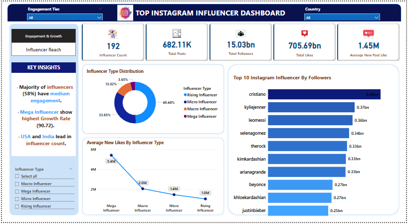
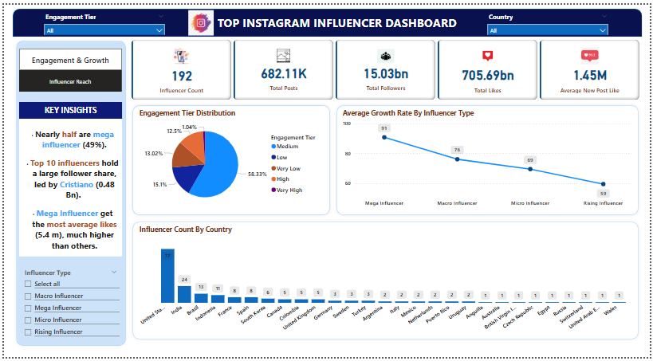

# Instagram-Influencer-Dashboard 📊

## 📌 Overview
This project analyzes data from 192 Instagram influencers across 30 countries using Power BI and SQL. The goal is to extract actionable insights on engagement, growth, and reach.

## 🔧 Tools Used
- Power BI
- SQL (PostgreSQL)

## 📂 Key Features
- Categorized influencers by follower count and type
- Analyzed engagement rate, growth rate, and like-to-follower ratio
- Interactive visuals with filters and slicers
- Country-wise and category-wise comparisons

## 📸 Dashboard Preview
Page 1: Follower & Engagement Overview

Page 2: Insights by Category and Country

## 📈 Key Insights
- Micro-influencers had highest engagement rates.
- Most influencers are from the USA, India, and UK.
- Health and Fitness category dominated engagement metrics.
